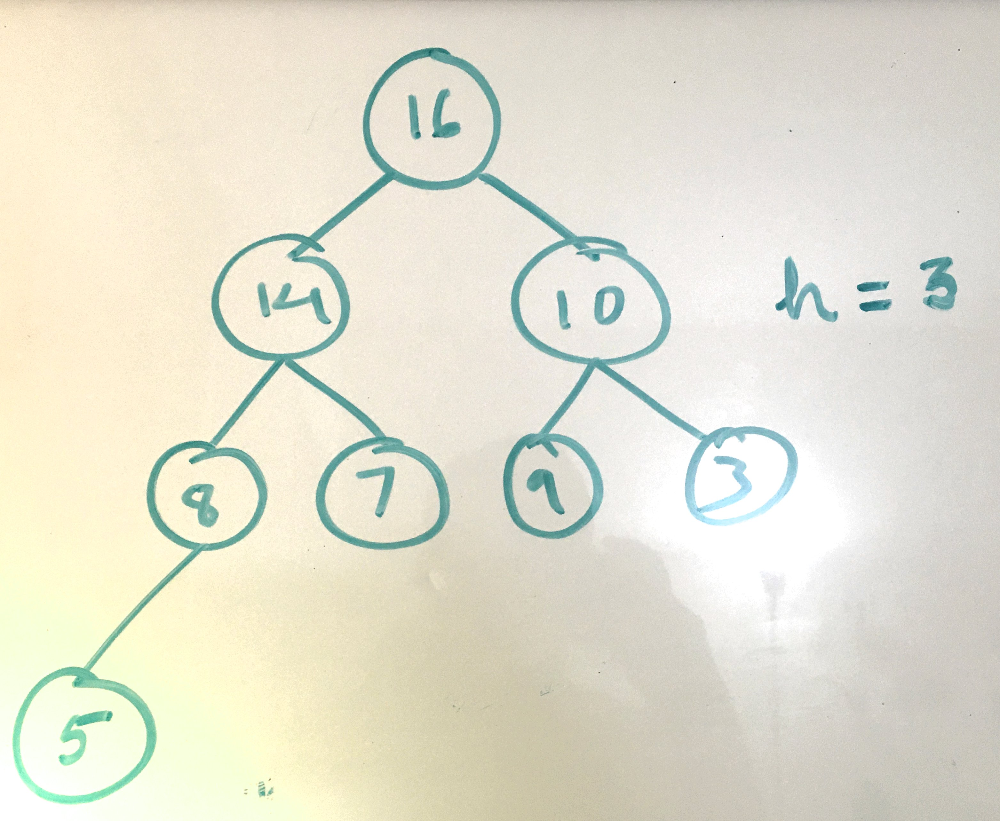
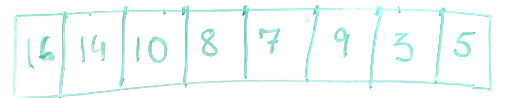

<h1>Binary Heaps</h1>

	<h4>Definition: </h4>
		It is a <ul>
	 	<li>Tree</li>
	 	<li>Binary Tree</li>
	 	<li>Complete Binary Tree (All levels filled except last level. Last level has to be filed from left to right)</li>
	 </ul>
	Since this is a complete binary tree, the elements can be stored in an array in a contiguous manner. For any node <i>x</i> present at index <i>i</i>,
	<ul>
		<li><i>x</i>left-child will be found at index <i>2*i</i>, if present.</li>
		<li><i>x</i>right-child will be found at index <i>2*i+1</i>, if present.</li>
		</ul>	
	
	
		<figure>
			
			<figcaption>Example of a binary heap (This is a Max-heap)</figcaption>
		</figure>
		<figure>
			
			<figcaption>Array representation of the same</figcaption>
		</figure>
	

<h4> Max and Min-heaps: </h4>
	Max-heap is a heap where the child subtrees of a node cannot have an element greater than the node itself. Min-heap is the opposite.
	Max-heap is used for heap-sort algorithm. Min-heap is used for implementing <b>Priority-Queues</b>.

	<h4>Questions:</h4>
	

		<question><b>What are the minimum and maximum number of elements in a heap pf height <i>h</i>?</b></question>
		<answer>Atleast <i>h-1</i> levels are completely filled.Hence, minimum would be 20+21+....+2h-1+1. Maximum would be 20+21+....+2h.</answer>
	

	

		<question><b>Where in a max-heap might the smallest elements reside, assuming that all elements are distinct?</b></question>
		<answer>If all elements are distinct, each level of nodes is greater than its lower level. Hence the minimum element must reside somewhere among the leaf-nodes.</answer>
	

	

		<question><b>Is a sorted array a min-heap?</b></question>
		<answer>yes!</answer>
	

<!-- 
<h3>Operations and Running-time:</h3>
	
<h4>In-order tree traversal: </h4>
	Prints out the elements in a sorted order. Runs in Linear time.

	
<h4>Querying for a node: </h4>
	if keyquery &le; keyroot, then check keyleft-child-root else keyright-child-root. The algorithm traverses the height of the tree hence runs in O(<i>h</i>) where <i>h</i> is the height of the tree.

	
<h4>Minimum and Maximum node: </h4> From root, follow the left child pointers till a leaf node is reached. This finds minimum-node. Similary,
	following the right child pointers till a leaf node is reached will find the maximum node. Both procedures run in O(<i>h</i>) where <i>h</i> is the height of the tree.

	

		

		<h4>Successor for a node <i>x</i>: </h4>
		<u>Case :Right child of <i>x</i> present</u>: 
		xsuccessor = Tree-Minimum (subtree rooted at xright-child) 
		<u>Case :Right child of <i>x</i> missing</u>:
		xsuccessor = Closest Ancestor of <i>x</i> whose left-subtree contains <i>x</i>
	

	

		<h4>Predecessor for a node <i>x</i>: </h4>
		<u>Case :Left child of <i>x</i> present</u>: 
		xpredecessor = Tree-Maximum (subtree rooted at xleft-child) 
		<u>Case :Left child of <i>x</i> missing</u>:
		xpredecessor = Closest Ancestor of <i>x</i> whose right-subtree contains <i>x</i>
	

	
Both successor and predecessor run in O(<i>h</i>) time

	

	

		<h4>Delete a node <i>x</i>: </h4>
		

			<u>Case : <i>x</i> has no children</u>:
			Set <i>Parent</i>x's (if present) pointer to <i>x</i> = NULL 
			<u>Case : <i>x</i> has one child <i>x</i>Child</u>:
			Set <i>Parent</i>x's (if present) pointer to <i>x</i> = <i>x</i>Child 
			If <i>Parent</i>x is null, this means <i>x</i> is the Root of the tree. In this case
			<i>x</i>Child becomes the new root of the tree. Nothing else changes. 
			<u>Case : <i>x</i> has both children</u>:
			<ol>
				<li><i>x</i>successor becomes the new root of the subtree rooted at <i>x</i>.</li>
				<li>Set <i>Parent</i>x's (if present) pointer to <i>x</i> = <i>x</i>successor, otherwise
					<i>x</i>successor becomes the tree root.</li>
			</ol>
			
 For 2) above, plucking out the successor from its existing position is a little tricky.
				If <i>x</i>successor happens to be the right-child of <i>x</i>, we just raise <i>x</i>successor to the position of <i>x</i>. 
				If <i>x</i>successor is not the right-child of <i>x</i>, we need to note that <i>x</i>successor must be the left-child of its parent (Parent<i>x</i>successor). It might point to a subtree as its right-child.  
				<b><u>Procedure: </u></b>
				<ol>
					<li>Set the left-child pointer of Parent<i>x</i>successor = <i>x</i>successorright-child.</li>
					<li>Set Parent pointer of <i>x</i>successorright-child = Parent<i>x</i>successor</li>
					<li>Set left-child pointer of <i>x</i>successor = left-child pointer of <i>x</i>.</li>
					<li>Set right-child pointer of <i>x</i>successor = right-child pointer of <i>x</i>.</li>
				</ol>
			

		

	

 -->

